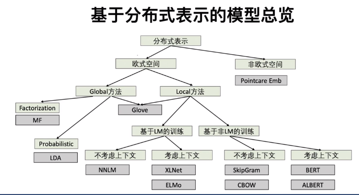
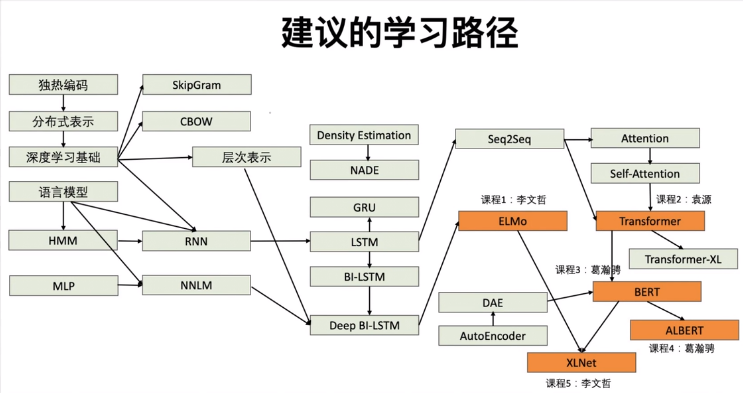
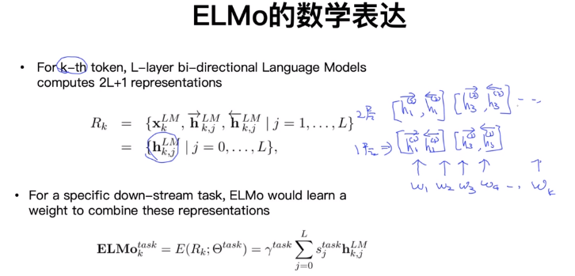

# 1、词向量与ELMO模型

## 1、基础部分
词的表示：通过量化的形式来表示一个单词
###1、one-hot编码 <无法表示单词之间语义的相似度>
我们： [1,0,0,0,0,0]
爬山:  [0,0,1,0,0,0]

###2、词向量
向量的降维<T-SNE>

学习词向量：
输入<文档>  -> 模型 -> 词向量

模型： CBow、SkipGram、NNLM、Glove、ME、ELMo、LDA

###3、语言模型：
判断是否一句话从语法上通顺
对于句子的计算

w1,w2,w3,w4,w5
w1 -> w2
w1,w2->w3
w1,w2,w3 -> w4

相关知识点：chain rule,Markov Assumption, 
Unigram,bigram,ngram
add-one smoothing,good-turning Smoothing, 
preplexity

基于分布式表示的模型总览

建议的学习路径

词向量训练常见的方法：
SKipGram： window=1
         maxmine p(w1|w2)P(w2|w1)p(w3|w2)p(w3|w4)

CBOW  P(w2|w1w3)P(w3|W2W4)

NNLM  P(w2|w1)P(w3|w2)P(w4|w3)  <2nd markov assumptions>

以上方法可以单独为每一个单词训练一个固定的词向量，
但是一个单词在一句话中可能有多重语义

如何学习一个单词在不同上下文中的词向量

## 2、ELMo
<deep contextualized word representations>

#####核心思想
1、基于语言模型的训练：使用LSTM作为基石
2、启发于深度学习中的层次表达
Deep BI-LSTM
对于一个单词，动态地学习在上下文中的词向量

###（1）利用LSTM学习词向量（语言模型）
单向 LSTM T1->T2->T3
双向 LSTM(BI-LSTM) T1<->T2<->T3 (近似双向)

###（2）双向LSTM结合深度学习
深度学习图像，可以学习每一个层级的特征，每一个层级的特征信息从简单到复杂，越来越能
体现图像表示的内容

类比文本：
单词特征 -> 句法特征 -> 语义特征

###（3）ELMO

