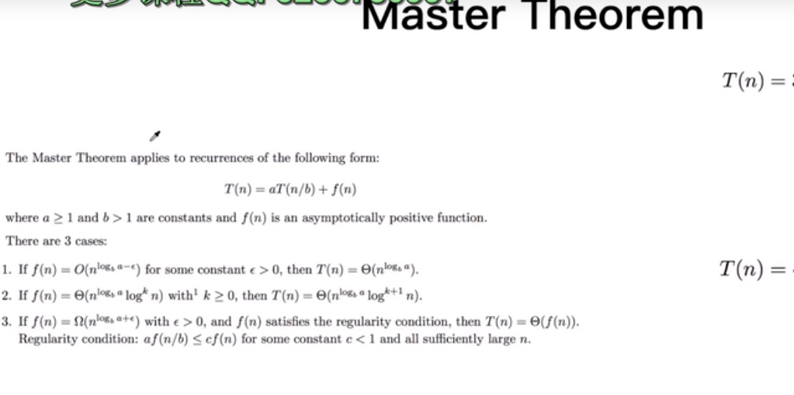
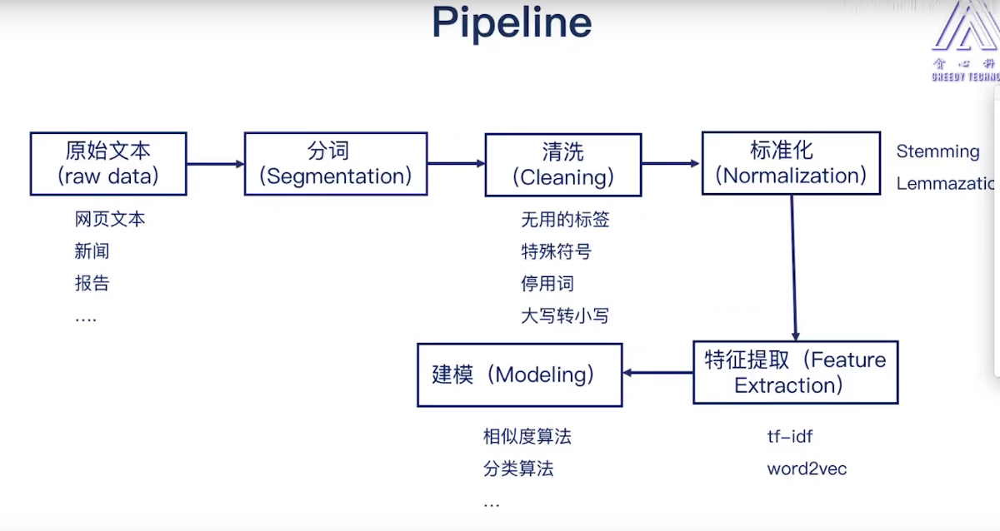

#自然语言处理关键技术
##自然语言处理技术的四个维度

语义（NLU）  
句子结构（句法分析、依存分析）  
单词（分词，词性，NER：命名实体识别）   
声音，  

#算法复杂度
时间复杂度与空间复杂度
##主定律方法  
（1）T(n) = aT(n/b) + f(n2) 时间复杂度（子任务）  
  
（2）递归时间复杂度 f(n) = f(n-2) + f(n-1)  
    时间复杂度：计算调用深度、每一层的操作个数
    空间复杂度：中间调用都会压栈，会存在很多的重复调用。上下文的切换
    

##归并排序
[1,3,8,9,4,5,9,2]  
--> [1,3,8,9] [4,5,9,2]  
归并两个列表

复杂度： T(n) = T(n/2) + T(n/2) + o(n) = 2T(n/2) + o(n)  
             = T(n/4) + T(n/4) +O(n/2) +... =  4T(n/4) + 2O(n)  
             ...  
             = nT(1) + logn O(N)
             
        
#问答系统  
PipeLine  

